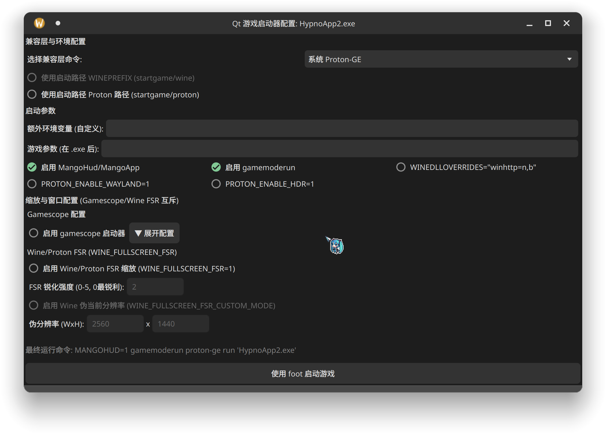

# Qt/Python 游戏启动器

这是一个基于 **PySide6 (Qt for Python)** 编写的游戏启动器前端。

它旨在解决在 Linux 系统上启动 Windows 游戏（通过 Wine 或 Proton）时，需要手动组合复杂的环境变量、兼容层命令和启动参数的问题。用户可以通过一个简洁的图形界面，快速配置并启动 `.exe` 文件。

> **本启动器中的所有选项数量、默认勾选状态和预设参数，均是基于个人游戏和系统习惯设定的。您可以根据自己的需求自由调整或扩展。**

~~我用来管理非steam的galgame的~~

